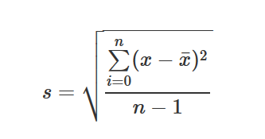

## Objectives

1. Demonstrate the use of basic operators
2. Develop familiarity with classes
3. Develop familiarity with R Markdown syntax.
4. Practice using R Studio projects.
5. Practice using R Markdown scripts.

## Expectations

1. The assignment must be submitted as a zip file containing an RStudio project and an R markdown script.  
2. The R markdown script must be reproducible. 
3. In exercises where you are asked to describe or explain, provide several sentences in your answer.
4. Your R markdown script should include the text of the original exercise as a block quote.

### Exercise 1

Explain why the first segment of code below works, but the second segment does not.

```{r, error = TRUE, eval = FALSE}
x <- 13
y <- 11
z <- "eleven"

# Segment 1: Working example
x + y

# Segment 2: Failing example
x + z
```

### Exercise 2
In [this chapter from _Advanced R_](http://adv-r.had.co.nz/Exceptions-Debugging.html) read the section "Debugging, condition handling, and defensive programming." Make a table to summarize the differences between errors, warnings, and messages. Give an example of when you might use each of them.


### Exercise 3
In an unevaluated code chunk, show how to call up the documentation for arithmetic operators

### Exercise 4
Make a table of the arithmetic operators in the documentation from Exercise 3.  The operators must appear as inline code and the table should describe what each operator does.

### Exercise 5



Use R Markdown's formula syntax to duplicate the formula given above.  You are allowed an encouraged to use online resources for help. (Hint: LaTeX syntax will work in the formula environment, even for HTML output)

### Exercise 6

1. Choose a number between 0 and 25.  Save it to an object.
2. Multiply your object by 4 and store it to another object.
3. Is the resulting number odd or even?  Prove it using an arithmetic function.

### Exercise 7

Create a numeric vector of random normal variates. Calculate its coefficient of variation.

### Exercise 8

1. Create a character vector of your three favorite colors and save it to an object.  
2. Convert the character vector to a factor
3. What happens when you run `as.numeric` on your factor?  Why does this happen?

### Exercise 9

Use the following vector to answer the questions below:

```{r}
x <- factor(c(3, 7, 4, 9))
```

1. What do you expect the result of `as.numeric` to be? (Be honest, there is no penalty if you guess incorrectly)
2. What is the actual result of `as.numeric`
3. What must you do to get the original values of `x` as numeric values?

### Exercise 10
Describe the attributes of factors.  (You may reference R For Data Science, R documentation, or R Documentation on Stack Overflow)

### Exercise 11
Which is the better method for indexing a data frame? Justify your answer.

```{r, eval = FALSE}
mtcars[3]
mtcars["disp"]
```

### Exercise 12

Write a brief statement about the characteristics of each of the following classes

1. `integer`
2. `numeric`
3. `logical`
4. `character`
5. `factor`
6. `Date`
7. `POSIXct`

### Exercise 13

What are the advantages of interpreted languages over compiled languages?

### Exercise 14 

Write a paragraph about what the statement:

"Statistics is the art of telling a story with data"

### Exercise 15

Write a statement in R code to solve each expression below.

```
36 + 51 = 
23   22 = 45
52 - 21 = 
65 - 55 = 
   + 45 = 90
103  33 = 70
2  *    = 0
10 /  5 = 
20    5 = 100
34 * 10 = 
14 /    = 2
114 /   = 57
```

### Exercise 16
Use logical indexing to extract the even numbers from `x <- 1:20`

Then extract the odd numbers

### Exercise 17

Make a 5 x 7 matrix of random numbers from an exponential distrubtion with mean 5. (make sure it is reproducible!)

After generating the matrix, 
1. Extract the third column
2. Extract the fourth row
3. Extract the second and third columns of the fith row.
4. Extract the first, second and fourth rows of the seventh column.

### Exercise 18

Explain why subsetting a list is no different than subsetting a column. Use examples.

### Exercise 19
Demonstrate the difference between the `[[` and `[` operators on a list.
